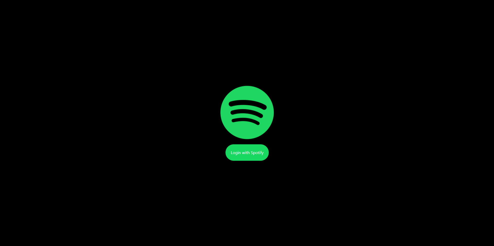
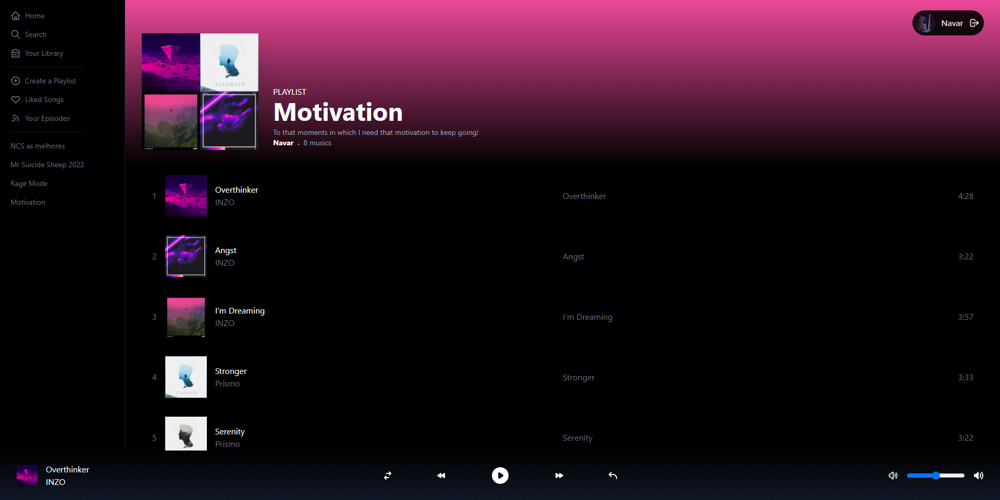

<h1 align="center">Spotify 2.0</h1>

---

## Be Welcome!

Thanks for checking out this project!

This project is part of [Sonny Sangha](https://www.youtube.com/channel/UCqeTj_QAnNlmt7FwzNwHZnA) React tutorials.

**Up to this moment some features are unavailable due to some problems with the API.** 

**You need a Premium Spotify account in order to use all the functions of the Spotify API.**

**Don't forget to set your own environment variables.**

## Links

- Sonny Sangha build live: [Spotify 2.0](https://www.youtube.com/watch?v=3xrko3GpYoU&t=13854s)
- Spotify for developers: [Spotify for developers](https://developer.spotify.com/)

## Built with

- [React](https://reactjs.org/) - JS library
- [Next.js](https://nextjs.org/) - React framework
- [Tailwind css](https://tailwindcss.com/) - CSS framework
- [Next Auth](https://next-auth.js.org/) - User authentication library
- [Recoil](https://next-auth.js.org/) - State management library for React
- [Spotify Web api](https://github.com/thelinmichael/spotify-web-api-node) - Wrapper/client for the Spotify Web API that runs on Node.JS and the browser

## Useful resources

- [Middleware](https://nextjs.org/docs/middleware) - Next doc about middlewares
- [Custom React hooks](https://reactjs.org/docs/hooks-custom.html) - React doc about custom hooks
- [Recoil basic tutorial](https://recoiljs.org/docs/basic-tutorial/intro/) - A basic introduction to Recoil
